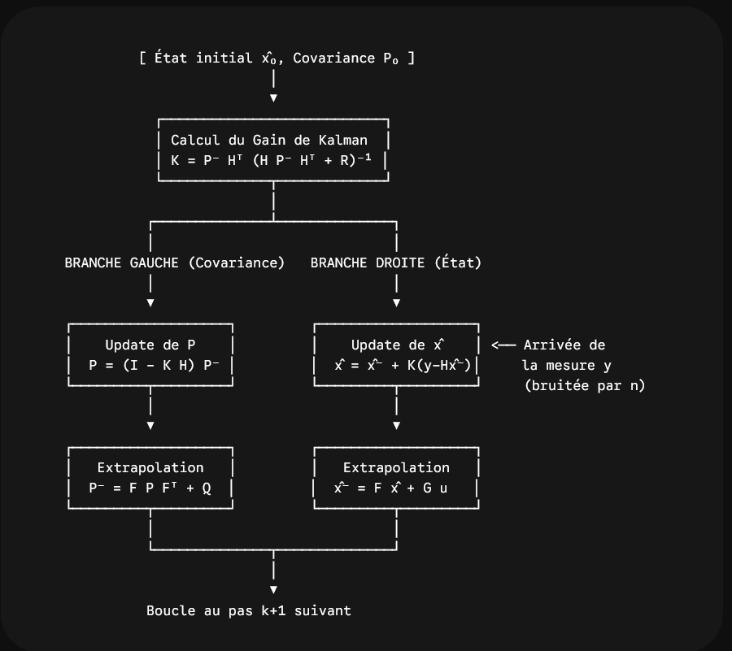

Schéma KF

### Légende des termes

| Symbole | Nom | Rôle / Définition |
| --- | --- | --- |
| $x_k$ | **Vecteur d'état réel** | La vérité terrain physique à l'instant $k$ (souvent inconnue). |
| $\hat{x}_k$ | **État estimé corrigé** (*a posteriori*) | La meilleure estimation de l'état après fusion avec le capteur. |
| $\hat{x}_k^-$ | **État estimé extrapolé** (*a priori*) | La prédiction de l'état issue uniquement du modèle dynamique, avant d'intégrer le capteur. |
| $u_k$ | **Vecteur de commande** | Les actions de contrôle envoyées au système (accélérateur, braquage, poussée moteur). |
| $y_k$ | **Vecteur de mesure** | Les valeurs brutes réelles renvoyées par les capteurs (GPS, odométrie, etc.). |
| $w_k$ | **Bruit de processus** | Perturbations non modélisées du système dynamique ($w_k \sim \mathcal{N}(0, Q)$). |
| $n_k$ | **Bruit de mesure** | Bruit électronique et imprécision intrinsèque des capteurs ($n_k \sim \mathcal{N}(0, R)$). |
| $F$ | **Matrice de transition d'état** | Relie l'état précédent $x_{k-1}$ à l'état courant $x_k$ selon les lois de la physique. |
| $G$ | **Matrice de commande** | Traduit l'impact des entrées de contrôle $u_k$ sur la variation de l'état. |
| $H$ | **Matrice d'observation** | Fait la passerelle entre l'espace d'état ($x$) et l'espace des capteurs ($y$). |
| $P_k$ | **Matrice de covariance de l'erreur** | Mesure l'incertitude sur l'estimation $\hat{x}$. Les termes diagonaux sont les variances des états. |
| $P_k^-$ | **Covariance extrapolée** | L'incertitude projetée dans le futur avant intégration de la mesure. |
| $Q$ | **Covariance du bruit de processus** | $\mathbb{E}[w_k w_k^T]$ : niveau d'imprécision qu'on accorde à notre modèle dynamique. |
| $R$ | **Covariance du bruit de mesure** | $\mathbb{E}[n_k n_k^T]$ : niveau de bruit statistique caractérisant les capteurs. |
| $K$ | **Gain de Kalman** | Matrice de pondération calculée à chaque pas pour doser la confiance entre modèle et mesure. |
| $(y_k - H\hat{x}_k^-)$ | **Innovation (ou résidu)** | Écart entre la mesure observée par le capteur et la mesure prédite par le modèle. |

Schéma EKF

# Filtre de Kalman Standard (KF) vs Filtre de Kalman Étendu (EKF)

Le **KF (Kalman Filter)** et l'**EKF (Extended Kalman Filter)** partagent la même philosophie : estimer un état de manière optimale en fusionnant un modèle dynamique et des mesures capteurs bruitées. 

La différence fondamentale réside dans la **linéarité** des équations du système.

---

## 1. Modélisation mathématique

### KF (Linéaire)
Les relations physiques sont de simples combinaisons linéaires (produits matrices-vecteurs) :

* **Dynamique :** $x_k = F x_{k-1} + G u_k + w_k$
* **Mesure :** $y_k = H x_k + n_k$

### EKF (Non linéaire)
Les relations font intervenir des fonctions quelconques $f$ et $h$ (trigonométrie $\cos/\sin$, racines carrées, divisions, etc.) :

* **Dynamique :** $x_k = f(x_{k-1}, u_k) + w_k$
* **Mesure :** $y_k = h(x_k) + n_k$

---

## 2. Tableau comparatif étape par étape

| Étape | Kalman Standard (KF) | Kalman Étendu (EKF) |
|---|---|---|
| **Extrapolation d'état** | $\hat{x}^- = F \hat{x} + G u$ | $\hat{x}^- = f(\hat{x}, u)$ |
| **Linéarisation dynamique** | *Inutile* ($F$ est déjà linéaire et constante) | $F_k = \left. \frac{\partial f}{\partial x} \right\vert_{\hat{x}}$ *(Jacobienne)* |
| **Extrapolation covariance** | $P^- = F P F^T + Q$ | $P^- = F_k P F_k^T + Q$ |
| **Linéarisation mesure** | *Inutile* ($H$ est déjà linéaire et constante) | $H_k = \left. \frac{\partial h}{\partial x} \right\vert_{\hat{x}^-}$ *(Jacobienne)* |
| **Innovation (résidu)** | $y - H \hat{x}^-$ | $y - h(\hat{x}^-)$ |
| **Gain de Kalman** | $K = P^- H^T (H P^- H^T + R)^{-1}$ | $K = P^- H_k^T (H_k P^- H_k^T + R)^{-1}$ |
| **Mise à jour d'état** | $\hat{x} = \hat{x}^- + K(y - H \hat{x}^-)$ | $\hat{x} = \hat{x}^- + K(y - h(\hat{x}^-))$ |
| **Mise à jour covariance** | $P = (I - K H) P^-$ | $P = (I - K H_k) P^-$ |

---

## 3. Les 4 différences fondamentales

### 1. La linéarisation par développement limité
* **KF :** Une loi gaussienne passant à travers une transformation linéaire **reste strictement gaussienne**. La moyenne et la covariance se propagent sans approximation.
* **EKF :** Une loi gaussienne passant à travers une fonction non linéaire est déformée et **perd sa nature gaussienne**. L'EKF contourne le problème en effectuant une approximation linéaire locale au premier ordre (série de Taylor) autour de l'estimation courante :
  $$f(x) \approx f(\hat{x}) + \left. \frac{\partial f}{\partial x} \right\vert_{\hat{x}} (x - \hat{x})$$
  Ce terme différentiel constitue la matrice **Jacobienne** ($F_k$ ou $H_k$).

### 2. Le couplage covariance / état
* **KF :** Les matrices $F$ et $H$ ne dépendent pas de l'état $\hat{x}$. Le gain $K$ et la covariance $P$ sont totalement indépendants des mesures $y$. Ils peuvent être **précalculés hors ligne**.
* **EKF :** Les Jacobiennes $F_k$ et $H_k$ sont réévaluées au point de fonctionnement courant ($\hat{x}$). La branche de calcul de l'incertitude ($P, K$) dépend donc obligatoirement des estimations d'état calculées en temps réel. Aucun précalcul complet n'est possible.

### 3. La précision et la convergence
* **KF :** L'estimateur est **optimal** (au sens de l'erreur quadratique moyenne minimale). Il converge toujours si le système est observable.
* **EKF :** L'estimateur est **sous-optimal** en raison de l'approximation du premier ordre. Si la dynamique est fortement non linéaire ou si l'incertitude initiale $P_0$ est trop grande, la linéarisation locale devient fausse et le filtre peut diverger.

### 4. Coût en calcul
* **KF :** Quelques multiplications matricielles de dimensions fixes.
* **EKF :** Nécessite à chaque cycle de recalculer formellement ou numériquement les dérivées partielles de chaque composante des fonctions $f$ et $h$ avant de multiplier les matrices.